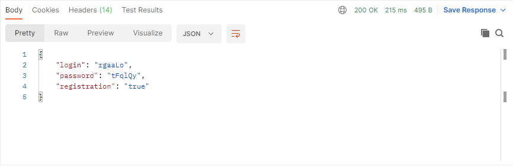

# Сервис URLShortCut

## Описание приложения

Сервис URLShortCut позволяет преобразовать передаваемые в приложение ссылки
в удобоиспользуемый сокращённый вид. Для преобразования ссылок необходима
предварительная регистрация в сервисе. Использование сокращённых ссылок 
регистрации не требует.

## Используемый стек технологий

1. Java 17
2. Spring boot 2.5.2
3. Spring MVC
4. Spring Data JPA
5. Spring Security
6. Java Bean Validation
7. Lombok 1.18.22
8. Liquibase 4.15.0
9. PostgreSQL 14

## Требуемое окружение
1. JDK 17
2. Apache Maven 3.8.5
3. PostgreSQL 14

## Запуск приложения

### Spring boot
1. Открыть диалоговое окно комбинацией клавиш Win+R;
2. В диалоговом окне прописать cmd и нажать OK;
3. Подключиться к PostgreSQL командой ```psql --username=USER_NAME``` и ввести пароль;
4. Создать базу данных url_short_cut командой ```create database url_short_cut```;
5. Подключиться к базе данных командой ```\c url_short_cut```;
6. Выйти из терминала psql командой ```\q```;
7. Перейти в корневую папку проекта;
8. Запустить приложение командой ```mvn spring-boot:run```;
9. Запустить приложение Postman для отправки запросов и получения ответов.

### Docker Compose

1. Собрать проект командой ```docker-compose build```;
2. Запустить проект командой ```docker-compose up```.

### Kubernetes

1. Запустить minikube командой ```minikube start```;
2. Перейти в директорию ```job4j_URL_short_cut\k8s```;
3. Запустить файл commands.sh командой ```sh commands.sh```;
4. Получить URL для подключения к сервису командой ```minikube service spring-boot-service```.

## Функционал приложения

### 1. Регистрация

Выполнить POST запрос по адресу ```http://localhost:8080/site/sign-up```, 
передав в блоке BODY запроса адрес сайта для регистрации ```{"name" : "SITE"}```


Получить ответ, в блоке BODY которого находятся сформированные приложением
логин, пароль и флаг регистрации (true/false - сайт зарегистрирован/сайт
уже был зарегистрирован)
```{"login": "LOGIN", "password": "PASSWORD", "registration": "true/false"}```



### 2. Авторизация

Выполнить POST запрос по адресу ```http://localhost:8080/login```,
передав в блоке BODY запроса полученные при регистрации логин и пароль
```{"login": "LOGIN", "password": "PASSWORD"}```


Получить ответ, в блоке HEAD которого находится сформированный приложением
Token (ключ) ```Authorization: Bearer xxx.yyy.zzz```


Скопировать сформированный приложением Token (ключ) ```Bearer xxx.yyy.zzz```
и добавить в блок HEAD запроса


### 3. Преобразование (регистрация) URL-адреса в сокращённый вид

Выполнить POST запрос по адресу ```http://localhost:8080/link/convert```,
передав в блоке BODY запроса URL-адрес для преобразования (регистрации)
```{"url" : "URL_ADDRESS"}```


Получить ответ, в блоке BODY которого находится сформированный приложением
уникальный код ```{"code": "CODE"}``` ассоциированный с переданным в запросе URL-адресом


### 4. Переадресация (выполняется без регистрации и авторизации)

Выполнить GET запрос по адресу ```http://localhost:8080/link/redirect/{CODE}```
с уникальным кодом


Получить ответ, в блоке HEAD которого находится ассоциированный с 
уникальным кодом URL-адрес ```CODE: URL_ADDRESS```


### 5. Статистика

Выполнить GET запрос по адресу ```http://localhost:8080/link/statistic```


Получить ответ, в блоке BODY которого находится сформированная приложением
статистика: все URL-адреса авторизованного в приложении сайта
и количество переходов по каждому URL-адресу 
```[{"total": "NUMBER", "url" : "URL_ADDRESS_1"}, {"total": "NUMBER", "url" : "URL_ADDRESS_2"}]```


## Контакты

Telegram: @smith_serg

Email: kuznetsov.s.i@bk.ru

